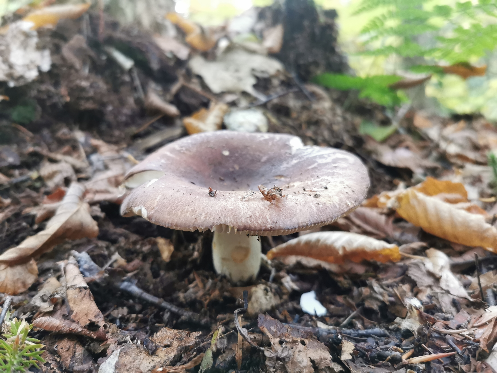

### 玫瑰山徒步

### 前言

眼看着加拿大秋意渐浓，连蒙特利尔市区的树都在逐渐变色。约着几个小伙伴去徒步看枫叶，岂不美哉？

这次我们选择的路线是Sentier Mont Larose (玫瑰山)。从蒙特利尔市区15号公路一路向北，到Saint-Sauveur小镇后换364号公路，一路走到底就到了玫瑰山。一共大约106公里，1个半小时的车程。

行车路线

### 徒步路线

徒步路线一共11.3公里，爬升一共大约547米。这条路上有不少人，最开始的时候爬升非常大，对徒步者的体力也是一个考验。

不一会儿，我们就到了第一个观景台，可以远眺远处的山河湖泊。山下是一个塔塔集团的卫星通讯基地，基地里有巨大的微波雷达天线。

塔塔集团（印度）的卫星通讯基地。

第二个观景台就更好了，很多游客选择在此稍作休息，吃点东西补充体力。

第二个观景台上看满山遍野的枫叶

穿梭在林间，别样枫情

秋天到了，各种蘑菇也长出来了

因为今年的秋天叶子红的比较晚，所以有相当一段地方的树叶都还是半红半绿的状态。不过叶子都在逐渐变色，只有红透了的叶子才会落到地上。大自然在无意之间为我们铺下了红地毯。

落到地上的都是红叶

途经一座湖泊，湖光山色

途经一个湖泊，湖面上的木头都枯萎后呈现出白色的表面。仿佛一派外星景象。

一个由于河狸水坝形成的湖泊

秋色继续

加拿大的图腾之一——因努伊特石堆

我们回程的时候已经是日落时分，阳光洒落在林间树叶上的感觉分外显眼。而此时，再好的相机也无法记录那种美妙的感觉。

### 结语

枫叶正当红，各位看官们有没有在这感恩节出去看看呢。
如果有兴趣加入我们徒步队伍的小伙伴，欢迎留言评论呀~
