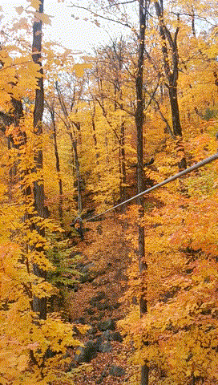

### 前言

说到滑索你能想到什么呢？是特种兵、特工的高难度任务？是极限运动爱好者的空中速降？利用钢索以跨越山谷、河流等天堑，体验速度与激情、肾上腺素飙升的感觉。
近些年来，随着人民生活水平的提高，对娱乐活动的需求也不断增加，滑索运动不再是少数高端玩家的专利，而在年轻人中掀起了一股热潮。这不，我的朋友就邀我一起去蒙城北边的滑索体验一把空中飞人的感觉。在此感谢一起玩耍小伙伴的邀请。

是的，没错。在蒙城北边一个小时左右的Acro-Nature提供了蒙城附近性价比最高的滑索体验！

我们的活动很幸运得预定到了2022年季度的最后一个周末（10月15日）。虽然今年的滑索在成稿之时不再能去，但是给了各位看官一个下次春暖花开后的好去处。

[Acro-Nature官方网站](https://www.sommets.com/en/acro-nature/)

Acro-Nature的网站

### 如何到达

行车路线

从蒙城出发，15号公路一路向北。转364公路再向西北行驶11公里即能到达。
门票和项目

Acro-Nature提供两种选择。

选择1：“The Big Course” —— 全程滑索体验
（我们的选择，强烈推荐）

2022年费率：41.99加元

一共有73 个各种形式的平衡木、钢丝绳类游戏，以及29 条高空滑索。

分为5个区域。其中：

Zone0：培训区，教练会示范如何使用安全绳，如何保持平衡以及最重要的——如何使用滑索，包括控制速度。

Zone1：热身区，你会体验到各种平衡木、梅花桩、摇摆桥以及几个滑索。难度中等，大部分人都能通过。

Zone2，继续简单 或 挑战困难。在这里你要做一个艰难的选择，是挑战加大的难度，还是继续刚刚的难度。

困难的路线对平衡感和体力有着非常高的要求。平衡木和摇摆桥的支点更少，摇晃更大。如果平衡感和体力不好，都难以通过。最后完成以后通常都精疲力竭了。
简单的的路线则继续刚刚Zone1的难度，比较新手友好。
Zone3：这是一个难度相对中等的区域。和Zone1差不多。

Zone4：速降区。在这个区域，滑索变成了主要的交通方式，一路滑索从山腰到山脚。在最后的大滑索之前，会有工作人员检查你的体力。因为有的人到最后的大跨度滑索可能会停在中间，需要靠自己的体力把自己拉到终点。如果缺乏足够的体力，则非常容易卡在最后。各位朋友量力而行。

选择2: “The Junior-Zoomer Course” —— 青少年滑索体验
（未成年人和体能不好的可以选择这个）

由于没有体验这个，所以并不知道有什么。

2022年费率：24.99加元

### 精彩集锦：

在山脚下的基地领到了装备。自己穿戴好，由工作人员检查后就没问题了，随后我们乘缆车上山。

坐着缆车上山，看漫山红遍

缆车结束到达山顶附近

我们一行人跟着教练进入培训区域

接下来就是我们的培训时间

走钢丝绳，顺便体验一下安全绳的力度

培训最后一课：滑索初步

Zone-1开始，我们一个一个排队开始

滑索速降-Zone1

在摇摆的木板桥上艰难的保持平衡。

Zone1的最后滑索

Zone4的悬索网兜桥

树上看秋色

Zone4滑索

Zone4最后一个滑索（@Kuma）

### 结语

这次活动完美的抓住了秋天的尾巴。秋天变色的树叶也为此行增添了不少色彩。在树间穿越非常奇妙，每个滑索长度各异，不过绝对是让我这种第一次接触的初学者玩到爽。
一些实用的建议：

Zone2高难度路线要三思而行，由于很难平衡，对于体力的需求十分巨大，体能不好的人容易挂在上面下不来，如果需要工作人员的救援，则你的本次体验到此为止，不能再继续进行了。

Zone4的一些滑索终点的平台有些高，注意不要磕到脚。保持体能，最后的大滑索真的是本场最佳，千万不要错过。

喜欢的朋友还等什么，收藏这篇文章，明年的夏天，约上好朋友一起去嗨皮呀。

### 相关链接

* [Acro-Nature官方网站](https://www.sommets.com/en/acro-nature/)