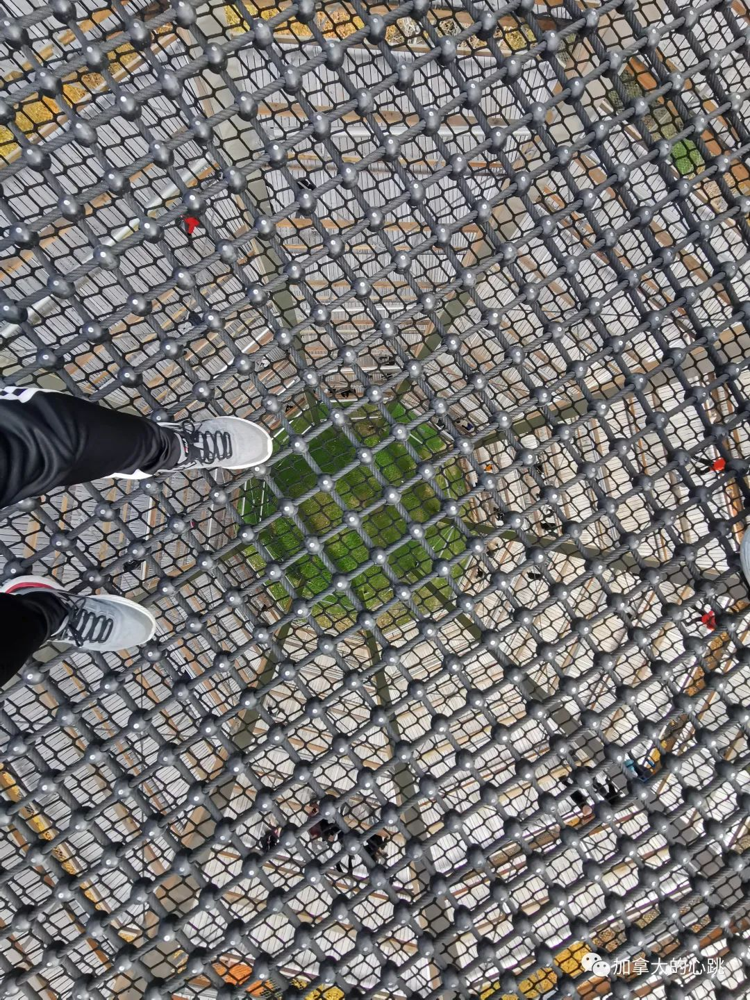

## 前言

你知道吗？在蒙城北边靠近翠湖山庄的地方，有一个巨大的木制观景台。它高达四十米，你会在二十米高的林间步道中穿行，最后到达这个神奇的地方。它就是Sentier des cimes Laurentides（劳伦蒂山徒步步道），这个步道在劳伦山脉中拔地而起。

## 如何到达

观景台位于蒙城西北部通往翠湖山庄的路上，距离蒙城120公里，大约一个小时20分钟。从市区由15号高速一路向北，在圣阿加特德蒙（Sainte-Agathe-des-Monts）小镇换117号公路，一直到Saint-Faustin-Lac-Carré小镇。

+ ==特别提示== ：如果遭遇人流量特别高的时段，你可以选择停在Ski Mont Blanc Quebec这个停车场。观景台提供免费的摆渡车，直达售票处旁边。几乎5分钟一趟，非常方便。

## 门票以及所需时间

学生票23刀，成人票29刀。（均为税前，2022年度数据）

该步道为无障碍步道，最大坡度仅为6%，与爬山步道动不动30%的坡度对比简直是轻而易举。一进门就能看到一个小松鼠雕像。

门口的小松鼠雕像也在欢迎游客

凌空栈道，在树林顶部穿梭。

从观景台底部看顶上，非常震撼

广角看的来时路

观景台南侧，能看到来时的空中栈道。

观景台北侧，秀色可餐。

顶部的安全网，可以在上面蹦蹦跳跳

怎么样，这个角度有没有恐高的感觉？

## 结语

这个观景台风景非常好，老少皆宜。BC省也有一个类似的观景台呢。秋天即将过去，红叶也渐渐离开树梢。各位不想宅在家里的小伙伴，快点抓住这秋天的尾巴呀。如果是你来到这里，你敢不敢尝试一下这勇敢者的游戏呢？
