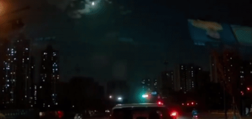

2022年注定是不平凡的一年。就比如这一年的11月26日，一颗火流星划过蒙特利尔的天际。

### 前言：

如果看到流星，你会想到什么？是天象？是占卜？还是赶紧许个愿？

流星是一个非常富有灵感的话题，因此它常常出现在许多不同类型的创作中。许多作家和诗人有流星相关的作品，这些作品通常会描绘流星闪耀的美丽景象。

>> 当他死去时，\
>> 把他摘下来，\
>> 把他分成一颗颗小星星。\
>> 这样他就能使天空如此美丽，\
>> 以至于整个世界都会爱上夜晚，\
>> 而不再崇拜那艳丽的太阳。\
>> When he shall die, \
>> Take him and cut him out in little stars, \
>> And he will make the face of heaven so fine \
>> That all the world will be in love with night \
>> And pay no worship to the garish sun. 

> 《威尼斯商人》——莎士比亚

流星也经常出现在电影、音乐、艺术和其他艺术形式中。例如，电影《流星花园》、电视剧《一起来看流星雨》都是围绕着流星进行的创作。中国对于流星的记载可追溯到3000多年前的夏朝：

>> 夏帝癸十五年，夜中星陨如雨。 

>《竹书纪年》

还有唐朝时期关于火流星的记载，已经明确记载了听到声音延迟的现象：

>> 有星如月，坠于东南，坠后有声。

>　——旧唐书·卷九·本纪第九·玄宗下

既然流星被无数人向往，在现实生活中能看到流星就更是极端罕见的事了。每年都会有一些流星雨，天文爱好者可以通过每年的流星雨预测，选择合适的观测地点。这一次，我想和大家分享的是，那一颗我亲眼得见的飞火流星。

### 流星的形成：

流星是一种天体现象，它是由小行星或彗星的碎片坠入地球大气层时所产生的一种亮闪烁的现象。当流星穿过大气层时，它会受到大气的摩擦力而产生火焰，并伴随着划过天空的壮观火花。流星的轨迹通常直线或抛物线，并且眨眼之间就会消失。

亮度排序（括号里是观察概率）：

1. 流星（亮度通常等价于土星或者木星的亮度，每年流星雨都能看到）

2. 火流星（亮度超过金星，一生一两次）

3. 超火流星（白天也可见，极难见到，可能产生陨石落到地表）

    * 末端爆炸解体

    * 陨石（通常伴随微弱的撞击，没有坑）

4. 小行星撞击事件（亮度超过太阳，根据维基百科：直径约50米的小行星平均一千年撞击地球一次，产生的爆炸相当于1908年通古斯大爆炸的能量）

    * 陨石坑

    * 生物大规模灭绝事件

美国流星协会介绍流星的海报

Fireball program 是国际流星组织（International meteror organization）所开发的一个火流星观测项目。该项目旨在通过观测火流星的轨迹和亮度等信息，研究太阳系内部的结构和运动情况。国际流星组织通过该项目收集到的数据，可以为科学家提供更为全面准确的火流星观测信息，从而更好地研究太阳系内部的天体运动情况。
目击火流星事件Event 9379-2022：

2022年11月26日晚，北美东部时间10:35pm左右（后准确时间更正为10:33pm），沿87号公路自纽约市向北至纽约州首府奥尔巴尼市的路上，大约200公里处的Catskill小镇附近。行驶方向大约为北偏东10-15度左右。
看到从视野（大部分为汽车前挡风玻璃）正上方向正下方稍偏左（西）划过一颗非常明亮的流星(火流星-Fireball)，尾部拖曳极长。至视野中部后突然变亮，后戛然而止般的消失不见。消失前一瞬白夜如昼，电光石火，片刻后又重回黑暗，一切发生在眨眼之间。没有听到声音。

国际陨石协会的火流星目击计划（International Meteor Organization - Fireball program）将此次火流星事件编号为：Event 9379-2022。在大概半个月以后的今天，视频报告被陆续上传，也为这篇文章提供了强有力的证明。

全球超过100人目击报告的流星事件：2022年11月一共有9起，2021年全年也仅有38起。我很幸运得以亲眼目睹其中之一。
经事后轨道计算，这颗火流星于蒙特利尔城区北部上方进入大气层，轨迹由西偏北10度左右（向渥太华北方）划过，并在蒙特利尔和渥太华中间燃烧解体。

此次火流星相关视频：

来源：蒙特利尔西岛的Mike Klymkiw

来源：魁北克省Tremblant山区的Mike Klymkiw

最后陨石照亮了整个湖面。

（这可能是实际上最接近这颗火流星的视频了）

来源：美国纽约州的Rebecca S.

（这大概就是我的视角）

来源：美国马萨诸塞州的Jeremiah Hoffman

来源：美国康涅狄格州的Mark Kirschner

看到火流星是非常罕见的，往往是一生中只有一次的事件。而且稍纵即逝，就在眨眼之间！如果你看到了火流星，可以去IMO的网站上分享给所有人哦。

2022年11月19日Event 8984-2022火流星事件。

Dereck Bowen摄于安大略省（by GoPro）。

2022年11月19日Event 8984-2022火流星经过CN塔。

By: EarthCam摄于多伦多市区。

2020年英仙座流星雨中的Event 4500-2020火流星事件。

Mark Guinn摄于美国南达科他州。

### 12月15日浙江火流星事件：

就在写稿期间，2022年12月15日傍晚18时左右，浙江多地观测到一颗火流星照亮夜空。这颗火流星更大，更距离人群聚居处，因此有更多的视频资料。

### 和许愿的关系：（用瞬间留住永恒）

流星和许愿之间有着密不可分的联系，这主要是因为流星被认为具有神秘的力量。在古代，人们相信流星是来自上天的信息，或者是上天派遣到地球上的使者。因此，人们常常在观测流星的时候许愿，希望能够得到上天的庇佑。这种做法至今仍然相当普遍，尤其是在那些发生流星雨的时候。

还曾记得富有哲理的一首小诗，辨证的讨论过瞬间于永恒的关系。也许流星匆匆而过，瞬间的璀璨却能常驻人们的记忆。也许这就是那在最美的时刻凋零。

>> 一粒细沙里窥见世界， \
>> 一朵野花里找到天堂。 \
>> 在你的手中掌握无限， \
>> 永恒在一刹那里收藏。 \
>>  To see a world in a grain of sand, \
>> And a heaven in a wild flower, \
>> Hold infinity in the palm of your hand, \
>> And eternity in an hour. 

> 《To see a world in a grain of sand》——19世纪英国诗人William Blake

### 和占卜的关系：（夜观天象）

在古代，人们曾将流星与占卜联系在一起，并相信它们能够预示着将来的大事件。例如，在中国古代，有些占星家会观测流星的出现，并且根据流星的出现位置和特征来预测将来的重大事件。比如：

来源：哈佛大学燕京图书馆。

>> 当王离与羽大战时，精兵四十万众，并章邯军故也。是时，枉矢西流，如火流星。蛇行若有首尾。广长如一匹布著天，矢星坠至地即石也。枉矢所触，天下所共伐也。

>《两汉纪》前汉纪

项羽在巨鹿之战时，与秦朝的王离军队大战，此时一火流星向西方划落坠地。由于当时秦朝严刑峻法，“天下之人，不敢言而敢怒” 。古人恰好利用此时的天象，流星所坠落的地方，“天下共伐”。
事后项羽全歼王离军，秦将王离被俘自焚而死、章邯投降。刘邦入主关中，开起了中国历史上的传奇一幕——楚汉相争。不过这就不是这次文章的话题了。

但是，这种做法并不科学，如今看来只是一种迷信。

### 结语：

目前，科学家已经非常清楚地了解了流星的形成过程，并且已经可以通过精确得观测来预测它们的出现。由于概率问题，火流星可遇不可求。

不过，每年都会来的流星雨还是值得体验一次的。那么，下一次的流星雨，你有没有想去看一看呢？

国际流星组织的“[流星雨日历](https://www.imo.net/resources/calendar/)”，有你需要的信息哦。

### 参考资料：

* [国际流星组织官网](https://www.imo.net/)
* [火球事件一览——国际流星组织官网](http://fireballs.imo.net/members/imo_view/browse_events)
* [火球事件——Event 9379-2022](http://fireballs.imo.net/members/imo_view/event/2022/9379)
* [中国哲学书电子化计划](https://ctext.org/wiki.pl?if=gb&res=675547&remap=gb)
