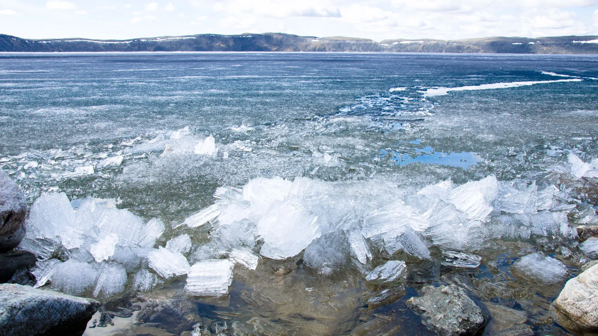
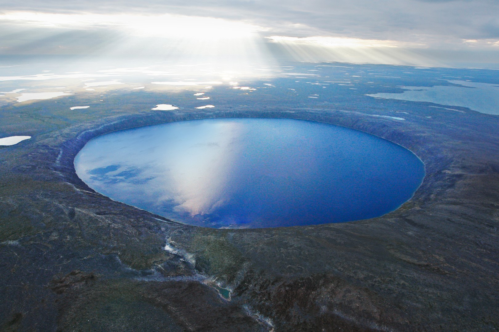
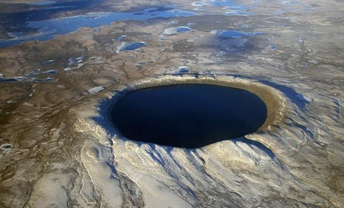
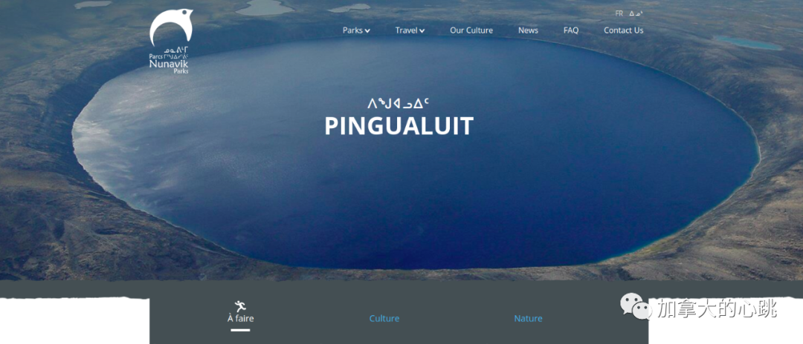
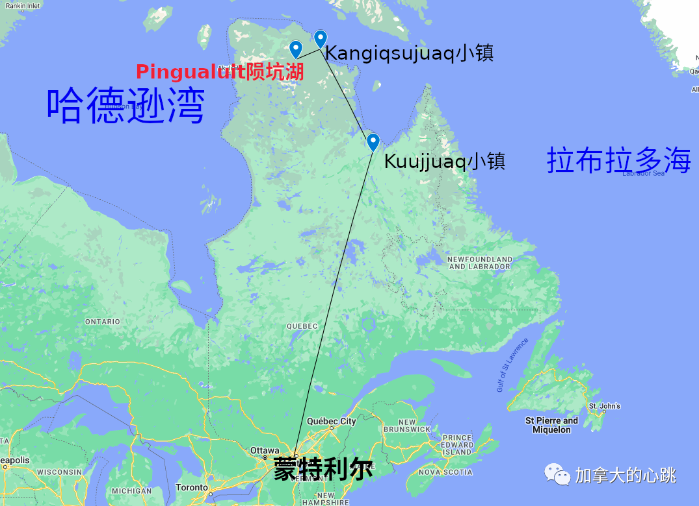

#### 地球上最纯净的湖泊
##### ——“至纯之水”

魁北克省的冰古拉蒂(Pingualuit)陨坑湖中的水非常纯净，其盐度仅为3ppm，相比之下五大湖的盐度为500ppm。大部分自来水为300ppm左右，矿泉水在100-200ppm附近，而纯净水在50ppm以下，而小于1ppm的水则为超纯水。这自然形成的湖水几乎可以和实验室级别的纯净水相比，这湖水是地球上最纯净的淡水，由于湖水过于纯净，所以也是能见度最深的湖泊之一(>40m)。

<!--  -->

### 前言：

位于魁北克省北部、北纬 61° 17′ 西经 73° 40′的位置有一个几乎完美圆形的湖，静静地躺在广袤的北极苔原中。这就是这次我们的主题——Pingualuit冰古拉蒂陨坑湖。

冰古拉蒂撞击坑形成于140万年前的一次大型流星体撞击。直径达 3.44 公里。它是魁北克最年轻的陨石坑之一，也是地球上最清晰、保存得最完好的陨石坑之一。（至少能在前十位）

1951年的《科学美国人》杂志报导了Pingualuit陨坑湖的发现。照片由加拿大皇家空军于 1948 年 7 月 3 日拍摄。

该陨坑湖1943年6月20日被美国空军发现，由于几乎完美的圆形，在战争结束前一直是一个导航地标。战争结束后，随着各种资料的解密。这个陨坑湖才逐渐进入西方人的视野。在1950年代引起了广泛而热烈的讨论。并被当时的加拿大报纸誉为世界“第八大奇迹”（如今看来这个称号有点过誉了，但是能看出加拿大人对其的喜爱程度）。然而，当地的原住民因纽特人早就知道它的存在，因为它清澈的水，他们将其称为“努纳维克水晶之眼”。

1943年的美国空军飞机的机组人员拍摄照片。显示了几乎正圆形的形状。由于地处偏远，直到1950年代才开始地质勘查。

1950年代的加拿大报纸，将其称为世界“第八大奇迹”。

由于撞击作用，湖泊四周高高隆起，拱卫着这异常清澈的蓝色宝石。2007 年 11 月 30 日，该陨坑湖被正式设立为公园。陨坑湖的名称几经变换，于1999年正式确立为Pingualuit（因纽特语：ᐱᖑᐊᓗᒻᒥ ᐱᓱᖕᖑᐊᑐᑦ，意思是“疙瘩”, 中文媒体翻译为：冰古拉蒂陨坑湖），也有昵称为“水晶之眼”。它还有曾用名：New Quebec Crater 新魁北克陨石坑, Ungava Crater 和 Chubb Crater 丘布陨石坑。

冰古拉蒂陨坑湖的卫星图像（by Google Earth）。

冰古拉蒂陨坑湖水深267米，是魁北克省最深的湖泊之一。陨石坑口边缘高出封闭湖面 100 多米，与水面呈 40 至 45 度角。在陨石坑附近徒步需要非常好的体能和经验。

### 如何探索：

公园网站

魁北克省政府在冰古拉蒂设立公园后，该公园管理处提供全程导游服务。可拼团也可自行组队，行程比较灵活。

注意：由于地处北极圈附近，加上水深非常。冰古拉蒂陨坑湖一年只有几周的时间能够完全解冻，所以即使是盛夏，看到半冰封的湖面也是非常有可能的。

价格：参考一下9天的All inclusive行程（2022年价格为4800$加元，相比3000$CAD的往返机票，这个价格还算良心）。以下行程从冰古拉蒂公园网站获取。[冰古拉蒂公园网站](https://www.nunavikparks.ca/en/parks/pingualuit）

### 夏季标准行程：

第 1 天 | 探索 Kangiqsuajuaq 北部村庄

从蒙特利尔出发，在魁北克北方小镇 Kuujjuaq（飞行时间大约2 小时 20 分）转机，然后前往 Kangiqsujuaq（使用Twin Otter双水獭型小型飞机飞行 60-90 分钟）。

从蒙特利尔到Pingualuit公园的航线地图

抵达 Kangiqsujuaq 后，Kangiqsujuaq adventure 或 Nunavik Parks 的工作人员将迎接您。您将进行城镇游览，更好地了解加拿大北方的生活方式。然后，您将前往酒店办理入住手续，并在晚饭前自由活动。

住宿：Coop Hotel Kuujjuaq

第 2 天 | 社区生活、传统活动及周边地区

感受北方社区的生活

如此靠近北极的地方，极光岂不是信手拈来？

参观公园的解说中心。Kangiqsujuaq Adventure 团队将带您前往 Akulivik 地区（靠近哈德逊海峡的海湾，因纽特野生动物采集者经常光顾）、皂石采石场，如果潮汐允许，您可以直接从海湾采摘贻贝。利用您的空闲时间访问社区。

住宿：Coop Hotel Kuujjuaq

第 3 天 | 出发前往马纳苏里克湖（Lake Manarsulik）

您将乘坐双水獭飞机进行 20 分钟的全景飞行，前往公园内的马纳苏里克营地。如果天气好的话，可以趁此机会第一次徒步去看陨坑湖（来回：5公里到山脊，7公里到水边）。也可以在营地前的 Manarsulik 湖钓鱼，或者沿着 Vachon 河徒步旅行。此外，您还可以探索陨坑湖周围的区域，在马纳苏里克湖上划船，或者只是放松一下。如果您计划在公园钓鱼，请联系我们以确保在出发前获得所有所需的许可。

住宿：Manarsulik Camp 马纳苏里克营地（如图所示）

第 4 天 | 在陨坑湖徒步

根据天气情况，可以切换接下来几天的行程，以优化您在公园不同区域的游览。在营地的第二天，您可以徒步攀登标志性的 Pingualuit Crater 的山脊。一旦登上它们的顶峰，您就可以看到无比遥远的地平线，似乎无边无垠。您可以选择上山脊（来回5公里）、下到水边（来回加2.5公里）或绕一圈徒步10小时（来回22公里）。
请注意，公园内的所有路线均已有标识但未进行常态管理。路径由不稳定的岩石制成，有时很滑。建议谨慎行事，按照自己的步调行进并使用登山仗。

住宿：Manarsulik Camp 马纳苏里克营地

第 5 天 | Vachon 河和 Manarsulik 湖

在一整天的远足之后，您可以在马纳苏里克营地享受该地区宁静的氛围。您可以沿着 Vachon 河岸边行驶，或在我们的摩托艇导游的带领下探索 Manarsulik 湖的不同区域。这将是一个很好的机会，可以从您的向导那里了解更多关于这片土地的信息，或者享受特殊的渔场，将晚餐带回营地。

住宿：Manarsulik Camp 马纳苏里克营地

第 6 - 7 天 | 徒步前往 Puvirnituq 河峡谷

您将与导游一起乘坐摩托艇离开马纳苏里克，穿越马纳苏里克湖。您将开始 8 公里的徒步旅行，前往 Sangummaaluk 营地。您将携带行李，包括当晚所需的一切和两天的食物。徒步穿越极地苔原湿地和岩石地貌。
这次远足依旧需要技巧和耐心，登山仗是您的好朋友，使您的前进尽可能安全。Sangummaaluk 营地位于壮观的 Puvirnituq 河峡谷的顶部。您将欣赏到该地区的壮丽美景，并可能借此机会在宽阔的河流中抛钓几次。您将在第 7 天的中午离开，返回 Manarsulik 营地。

住宿：Sangummaaluk 营地和Manarsulik 营地

第 8 天 | 马纳苏里克并返回库朱亚克（Kuujjuaq）

在营地的最后一天，可以享受在该地区的最后时光，在湖中或河中钓鱼，在湖上划船，甚至最后一次回到陨坑湖，下到水面附近进行一次告别。Twin Otter 飞机将在 15 点左右接您，您将开始返回出发地的旅程，用记忆带走这次非凡旅程的所有亮点。

原住民保存鱼获的传统方式。

带动力的独木舟

住宿：Coop Hotel Kuujjuaq

第 9 天 | 从Kuujjuaq 北部村庄回到蒙特利尔

早餐后，Nunavik Parks 的工作人员将接您进行 Kuujjuaq 的一些活动：快速城镇游览、沿着 Koksoak 河向北朝 Ungava 海湾方向游览，尝试发现麝牛或放声高歌。然后是时候带着满满的珍贵回忆登上南下的航班返回蒙特利尔了。

### 结语：

游览Pingualuit陨坑湖是我的毕生梦想，虽然地处偏远，但是自从知道这个瑰宝存在的那一刻起，就在心中种下了一颗的种子。总有一天，我会踏足这片纯净的土地的。

>> 而世之奇伟、瑰怪，非常之观，常在于险远，而人之所罕至焉，故非有志者不能至也。

> 苏轼——《游褒禅山记》

各位看官，如果你也有想探索一下这个陨坑湖，请留言组队呀。

### 参考资料：

* [魁省公园管理厅Sepaq——Parc national des Pingualuit](https://www.sepaq.com/pq/pin/index.dot?language_id=1)
* [Pingualuit公园官方网站](https://www.nunavikparks.ca/en/parks/pingualuit)
* [Pingualuit公园官方网站的夏季行程](https://www.nunavikparks.ca/en/experiences/trekking-at-the-crater)
* [PINGUALUIT撞击坑](https://craterexplorer.ca/pingualuit-impact-crater/)
* [魁北克最后的边疆](https://www.thestar.com/life/travel/2010/06/30/quebecs_last_frontier_is_a_sight_to_see.html)
* [自然奇观：Pingualuit陨石坑](https://explorersweb.com/natural-wonders-pingualuit-crater/)